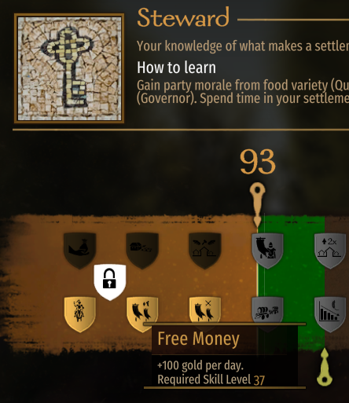

# Adding custom perks the the game
Looking at TaleWorlds code, adding a custom perk seems easy. However, you would soon run into issues such as the perk disappearing or being deselected. I, [vladim0105](https://github.com/vladim0105), spent a whole day coding and experimenting to fix those issues and is the reason why I am writing this tutorial. This guide will show you how to add a 100% working custom perk with only a few lines of code.
# How
There are two ways you could go about this, first one (the recommended one) would be to download the latest release of [BannerLib](https://github.com/sirdoombox/BannerLib/releases), adding it to your modules folder and then referencing it in your code. The second way would be to look at [BannerLib's code](https://github.com/sirdoombox/BannerLib) and copying it to make custom perks work. 
In this tutorial I will show how to use BannerLib to add custom perks.

Creating a perk:

 - We first need to create the ```PerkObject```. Note that ```perkId``` must be something unique, one suggestion would be to prepend your mod name to it:
```c#
	 PerkObject myPerk = GameplaySubModule.GetPerkSystem().CreateCustomPerk(game, myModName_myPerkId);
   ```
  - Then we need to initialize it:
```c#
   myPerk.Initialize("Perk Name", "Perk Description", The skill it belongs to, The skill level required to unlock it, Alternative skill, Primary perkrole, It's Primary Value, Secondary Perk Role, Secondary Value, Increment Type);
   ```
   - Full Example:
   ```c#
        PerkObject moneyPerk = GameplaySubModule.GetPerkSystem().CreateCustomPerk(game, "MyMod_MoneyPerk");
        moneyPerk.Initialize("Free Money", "+100 gold per day.", DefaultSkills.Steward, 37, null, SkillEffect.PerkRole.None, 100, SkillEffect.PerkRole.None, 0, SkillEffect.EffectIncrementType.Add);
   ```
- Then finally we need to update the perks, in your SubModule class, in the Game Initialization, add the following:
```c#
GameplaySubModule.GetPerkSystem().UpdatePerks();
```
- It should look something like this:
```c#
public override void OnGameInitializationFinished(Game game)
{
	base.OnGameInitializationFinished(game);
	PerkObject moneyPerk = GameplaySubModule.GetPerkSystem().CreateCustomPerk(game, "MyMod_MoneyPerk");
        moneyPerk.Initialize("Free Money", "+100 gold per day.", DefaultSkills.Steward, 37, null, SkillEffect.PerkRole.None, 100, SkillEffect.PerkRole.None, 0, SkillEffect.EffectIncrementType.Add);
	GameplaySubModule.GetPerkSystem().UpdatePerks();
	//Other code
}
```
And that is it, you have added a custom perk to the game!
To make it do something, you would write the relevant code somewhere else (depending on what you want the perk to do). 
To make the example perk actually add 100 gold per day, you would write something like this:
```c#
using BannerLib.Gameplay;

public override void OnGameInitializationFinished(Game game)
{
	base.OnGameInitializationFinished(game);
	PerkObject moneyPerk = GameplaySubModule.GetPerkSystem().CreateCustomPerk(game, "MyMod_MoneyPerk");
        moneyPerk.Initialize("Free Money", "+100 gold per day.", DefaultSkills.Steward, 37, null, SkillEffect.PerkRole.None, 100, SkillEffect.PerkRole.None, 0, SkillEffect.EffectIncrementType.Add);
	GameplaySubModule.GetPerkSystem().UpdatePerks();
	//To make it add 100 gold per day:
	CampaignEvents.DailyTickEvent.AddNonSerializedListener(this, () => { 
		foreach(Hero hero in Hero.All){
			if(hero.GetPerkValue(moneyPerk)){
				hero.ChangeHeroGold(moneyPerk.PrimaryBonus())
			}
		}
	});
}
```
Here is how it looks in game:




